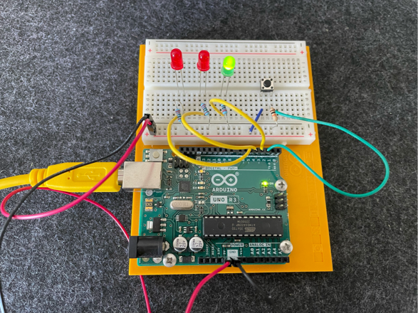

# LOVE-O-METER

## Monitor Serial Output

```
tinygo monitor -baudrate=9600
```

The default baud rate of the serial port for almost all microcontrollers supported by TinyGo is 115200.
The exceptions are boards using the AVR processors (Arduino Nano, Arduino Mega 1280, Arduino Mega 2560).

## Images



## References

[Serial Monitor](https://tinygo.org/docs/tutorials/serialmonitor/)
[Universal asynchronous receiver-transmitter](https://en.wikipedia.org/wiki/Universal_asynchronous_receiver-transmitter)
[Integrated Circuit - IC](https://en.wikipedia.org/wiki/Integrated_circuit)
[Asynchronous serial communication](https://en.wikipedia.org/wiki/Asynchronous_serial_communication)
[USB-to-serial adapter](https://en.wikipedia.org/wiki/USB-to-serial_adapter)
[Serial Port](https://en.wikipedia.org/wiki/Serial_port)
