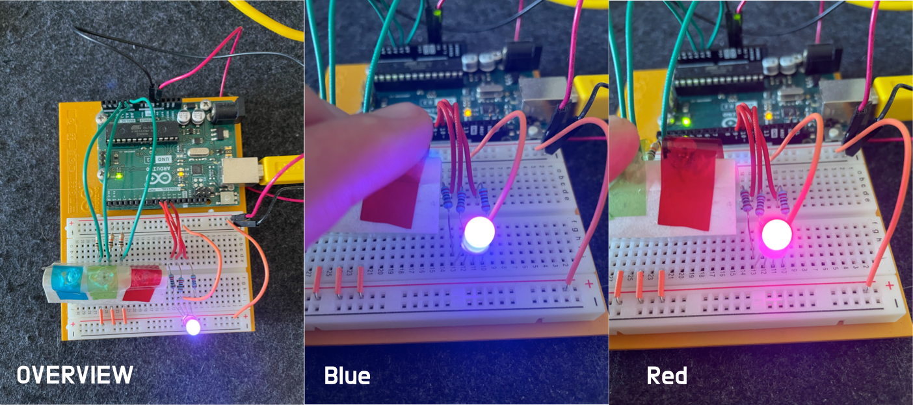

# COLOR MIXING LAMP

## Monitor Serial Output

### Flash

```
tinygo flash -target=arduino -port=/dev/tty.usbmodem1401 Project04/main.go
```

### Monitor Serial Output

```
tinygo monitor -baudrate=9600
```

## Images



## References

- [arduino pins reference](https://tinygo.org/docs/reference/microcontrollers/arduino/)
- [Basics of PWM (Pulse Width Modulation)](https://docs.arduino.cc/learn/microcontrollers/analog-output/)
- [Using PWM TingGo Tutorial](https://tinygo.org/docs/tutorials/pwm/)
