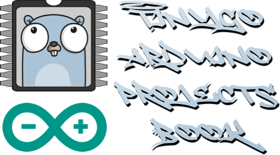

# Welcome to the TinyGo Arduino Projects Book.

All projects in this Repo are based off [Arduino Starter Kit Multi-language](https://store-usa.arduino.cc/products/arduino-starter-kit-multi-language?selectedStore=us) and
have been adapted to [TinyGo](https://tinygo.org).

## Setup

in order to run in NVim we use [tinygo.nvim](https://github.com/pcolladosoto/tinygo.nvim).
There is also a similar plugin/extension for VSCode [tinygo vscode extension](https://marketplace.visualstudio.com/items?itemName=tinygo.vscode-tinygo)

In order to run the code on the arduino board we need to install TinyGo on our system.
[Tinygo getting started MacOS](https://tinygo.org/getting-started/install/macos/)

Note that all packages are setup as part of my [.dotfiles](https://github.com/rdforte/.dotfiles).

## Usage

In the Project file where you are writing the source code for the arduino:

```
:TinyGoSetTarget arduino
```

This will enable us to get LSP support for Tinygo specific packages.

## Building and Deploying to Arduino

note you will have to find the device serial port in /dev (short for device) dirctory. It will be along the lines of `tty.usbmodem1401`.
If it does not show try unplugging the usb cable and then plugging it back in.
Once you have the port you can run the following command to flash the code to the arduino board.

```
tinygo flash -target=arduino -port=/dev/tty.usbmodem1401 Project00/main.go
```

## Monitor Serial Output

To monitor the serial output of the arduino board you can run the following command:

```
tinygo monitor -baudrate=9600
```

## Common Issues

### avrdude error: programmer is not responding

1. Unplug your board's USB cable from your computer.
2. Disconnect any shields, modules, external circuitry, etc. from your board.
3. Plug your board's USB cable back into your computer.
